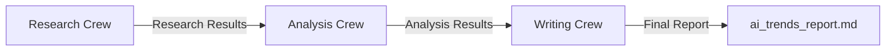

# AI Trends Analysis System - Multi-Crew Intelligence

A sophisticated AI-powered analysis system that leverages multiple specialized CrewAI teams working in sequence to research, analyze, and report on AI trends and developments. The system employs three distinct crews, each with specialized agents focusing on different aspects of the analysis process.

## 🌟 Features

- 🤖 Three specialized AI crews working in sequence
- 🔍 Deep research capabilities
- 📊 Strategic analysis and insights
- 📝 Professional report generation
- 🔄 Sequential information flow between crews
- 📈 Comprehensive trend analysis
- 🎯 Industry-specific impact assessment

## 🛠️ Technology Stack

- Python 3.10+
- CrewAI Framework
- Markdown for report generation
- YAML for configuration (optional)

## 👥 Crew Structure

### 1️⃣ Research Crew
- **Agent**: AI Research Analyst
- **Goal**: Find and analyze latest AI trends
- **Focus Areas**:
  - Breakthrough technologies
  - Industry adoption trends
  - Major research developments
  - Sector impact analysis

### 2️⃣ Analysis Crew
- **Agent**: Strategic AI Analyst
- **Goal**: Analyze trends and provide strategic insights
- **Focus Areas**:
  - Market impact assessment
  - Industry-specific implications
  - Growth projections
  - Challenges and opportunities

### 3️⃣ Writing Crew
- **Agent**: Technical Report Writer
- **Goal**: Create comprehensive AI trends report
- **Deliverables**:
  - Executive Summary
  - Current AI Landscape
  - Key Trends and Developments
  - Industry Impact Analysis
  - Future Outlook
  - Recommendations

## 📋 Project Structure

```
ai-trends-analysis/
├── src/
│   └── practice_1/
│       ├── main.py          # Main implementation with crew definitions
│       └── config/          # Optional configuration files
├── .env                     # Environment variables
├── pyproject.toml          # Project configuration
├── README.md               # This file
└── ai_trends_report.md     # Generated analysis report
```

## 🔄 Information Flow



## 🚀 Getting Started

1. **Clone the repository**
```bash
git clone <repository-url>
cd ai-trends-analysis
```

2. **Set up Python environment**
```bash
python -m venv .venv
source .venv/bin/activate  # On Windows: .venv\Scripts\activate
```

3. **Install dependencies**
```bash
pip install -e .
```

4. **Run the analysis**
```bash
crew
```

## 📊 Output

The system generates a comprehensive AI trends report (`ai_trends_report.md`) that includes:
- Executive Summary
- Current AI Landscape Analysis
- Key Trends and Developments
- Industry Impact Assessment
- Future Outlook
- Strategic Recommendations

## 🔍 Process Flow

1. **Research Phase**
   - AI Research Analyst collects and analyzes latest trends
   - Focuses on breakthrough technologies and innovations
   - Examines industry adoption patterns
   - Identifies major research developments

2. **Analysis Phase**
   - Strategic Analyst processes research findings
   - Assesses market impact and implications
   - Projects future growth trajectories
   - Identifies challenges and opportunities

3. **Writing Phase**
   - Technical Writer synthesizes all information
   - Creates structured, comprehensive report
   - Ensures clarity and accessibility
   - Provides actionable insights

## 🛠️ Customization

You can customize each crew by:
- Modifying agent roles and backstories
- Adjusting task descriptions
- Adding specific focus areas
- Enhancing output requirements

## 🤝 Contributing

Contributions are welcome! Areas for improvement include:
- Additional specialized crews
- Enhanced analysis capabilities
- New report formats
- Integration with other tools

## 📝 License

This project is licensed under the MIT License - see the LICENSE file for details.

## ⚠️ Disclaimer

The AI trends analysis and recommendations provided by this tool are for informational purposes only. The accuracy and completeness of the analysis depend on the AI models' capabilities and available information. Always verify critical information through multiple sources.
