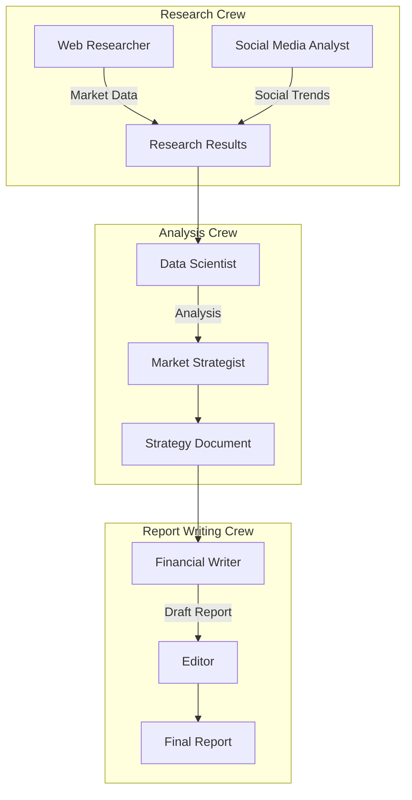

# Market Intelligence System - Multi-Crew Analysis Platform

A sophisticated market analysis platform that leverages multiple CrewAI teams working in sequence, with each crew containing multiple specialized agents. The system employs three distinct crews for research, analysis, and report writing, creating a comprehensive market intelligence pipeline.

## 🌟 Features

- 🤖 Three specialized crews with multiple agents in each
- 🔍 Multi-source market research capabilities
- 📊 Dual-layer analysis system
- 📝 Professional report generation with editorial review
- 🔄 Sequential information flow between crews
- 📈 Comprehensive market analysis
- 🎯 Social media trend integration

## 👥 Crew Structure

### 1️⃣ Research Crew
**Purpose**: Collect market data from multiple sources
- **Web Researcher Agent**
  - Role: Web data collection
  - Goal: Gather market data from news sources and reports
  - Tasks: Collect latest market trends from financial reports

- **Social Media Analyst Agent**
  - Role: Social media trend analysis
  - Goal: Analyze market trends on social media
  - Tasks: Track and analyze market-related social media trends

### 2️⃣ Analysis Crew
**Purpose**: Process and analyze collected data
- **Data Scientist Agent**
  - Role: Data analysis and insight extraction
  - Goal: Analyze market trends and extract key insights
  - Tasks: Process research findings and identify patterns

- **Market Strategist Agent**
  - Role: Strategy development
  - Goal: Develop strategies based on market trends
  - Tasks: Create actionable market strategies

### 3️⃣ Report Writing Crew
**Purpose**: Create and refine final reports
- **Financial Writer Agent**
  - Role: Report creation
  - Goal: Create professional market reports
  - Tasks: Write detailed market analysis reports

- **Editor Agent**
  - Role: Quality assurance
  - Goal: Ensure report quality and clarity
  - Tasks: Proofread and refine final reports

## 🔄 Process Flow



## 🛠️ Technology Stack

- Python 3.10+
- CrewAI Framework
- Markdown for report generation
- UTF-8 encoding for report handling

## 📋 Project Structure

```
market-intelligence-system/
├── src/
│   └── practice_1/
│       ├── main.py          # Main implementation with crews and agents
│       └── config/          # Configuration files
├── .env                     # Environment variables
├── pyproject.toml          # Project configuration
├── README.md               # This file
└── market_analysis_report.md # Generated analysis report
```

## 🚀 Getting Started

1. **Clone the repository**
```bash
git clone <repository-url>
cd market-intelligence-system
```

2. **Set up Python environment**
```bash
python -m venv .venv
source .venv/bin/activate  # On Windows: .venv\Scripts\activate
```

3. **Install dependencies**
```bash
pip install -e .
```

4. **Run the analysis**
```bash
crew
```

## 📊 Output Structure

The system generates a comprehensive market analysis report with:
1. **Market Research Findings**
   - Web-based market data
   - Social media trends analysis
   - Current market conditions

2. **Strategic Analysis**
   - Data-driven insights
   - Market trend analysis
   - Strategic recommendations

3. **Final Report**
   - Executive summary
   - Detailed market analysis
   - Strategic recommendations
   - Implementation guidelines

## 🔍 Execution Flow

1. **Research Phase**
   - Web Researcher collects market data
   - Social Media Analyst gathers social trends
   - Data is combined into comprehensive research results

2. **Analysis Phase**
   - Data Scientist processes research findings
   - Market Strategist develops strategic recommendations
   - Results are formatted for report writing

3. **Writing Phase**
   - Financial Writer creates initial report
   - Editor reviews and refines content
   - Final report is generated and saved

## ⚙️ Configuration Options

You can customize the system by:
- Modifying agent roles and goals
- Adjusting task parameters
- Adding new data sources
- Customizing report formats
- Changing process sequences

## 🛡️ Error Handling

The system includes:
- Comprehensive error catching
- Progress monitoring
- Status updates
- UTF-8 encoding support
- File operation safety checks

## 🤝 Contributing

Areas for enhancement:
- Additional research sources
- New analysis methods
- Enhanced report formats
- AI model improvements
- Additional agent specializations

## 📝 License

This project is licensed under the MIT License - see the LICENSE file for details.

## ⚠️ Disclaimer

The market analysis and recommendations provided by this system are for informational purposes only. Always verify market data and consult with qualified financial advisors before making investment decisions.
