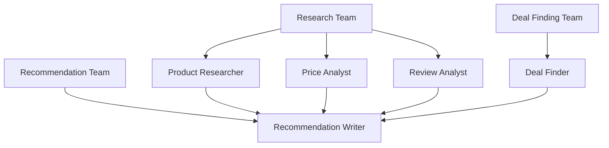

# AI Agent Systems

This repository contains multiple AI agent systems built using the CrewAI framework.

## 1. AI Shopping Assistant

### Overview
The AI Shopping Assistant is an intelligent system that leverages multiple specialized AI agents to provide comprehensive product research, price analysis, and shopping recommendations.

### Features
- 🤖 Five Specialized Agents:
  - Product Researcher: Deep product analysis and comparison
  - Price Analyst: Price trend analysis and value assessment
  - Review Analyst: Customer feedback and satisfaction analysis
  - Deal Finder: Active deals and promotions discovery
  - Recommendation Writer: Comprehensive report generation

### Agent Structure


### Process Flow
1. **Research Phase**
   - Product specification analysis
   - Price trend tracking
   - Customer review assessment

2. **Deal Finding Phase**
   - Current deals discovery
   - Price comparison
   - Promotion identification

3. **Recommendation Phase**
   - Data synthesis
   - Report generation
   - Final recommendations

### Usage
```python
from shopping_agent import ShoppingAgentSystem

# Initialize the system
shopping_system = ShoppingAgentSystem()

# Run analysis for a product
shopping_system.run_shopping_analysis("4K Smart TV under $1000")
```

### Output
The system generates a detailed report (`shopping_recommendation.md`) containing:
- Product specifications and features
- Price analysis and trends
- Customer sentiment analysis
- Current best deals
- Final recommendations

## 2. YouTube Trend Finder

### Overview
An AI-powered system that tracks and analyzes trending videos on YouTube, providing detailed insights and information about current popular content.

### Features
- 🎥 Comprehensive video trend analysis
- 📊 View count and engagement metrics
- 🏷️ Multi-category coverage
- 📝 Detailed reporting

### Usage
```python
# Initialize and run the YouTube trend finder
result = youtube_crew.kickoff()
```

### Output
Generates a detailed report (`youtube_trends.txt`) containing:
- Trending video titles and channels
- View counts and metrics
- Content descriptions
- Trending reasons
- Category organization

## Technical Requirements

### Dependencies
- Python 3.10+
- CrewAI Framework
- LangChain
- OpenAI API key (for GPT-3.5 integration)

### Installation
```bash
# Clone the repository
git clone <repository-url>

# Install dependencies
pip install -r requirements.txt

# Set up environment variables
export OPENAI_API_KEY="your-api-key-here"
```

### Project Structure
```
project/
├── src/
│   └── practice_1/
│       ├── main.py              # YouTube trend finder
│       ├── shopping_agent.py    # Shopping assistant
│       └── config/             # Configuration files
├── README.md
└── requirements.txt
```

## Contributing
Contributions are welcome! Areas for enhancement:
- Additional agent specializations
- New product categories
- Enhanced analysis capabilities
- Real-time price tracking
- Integration with e-commerce APIs

## License
This project is licensed under the MIT License - see the LICENSE file for details.

## Disclaimer
The recommendations and analysis provided by these AI systems are for informational purposes only. Always verify information from multiple sources before making purchase decisions.
